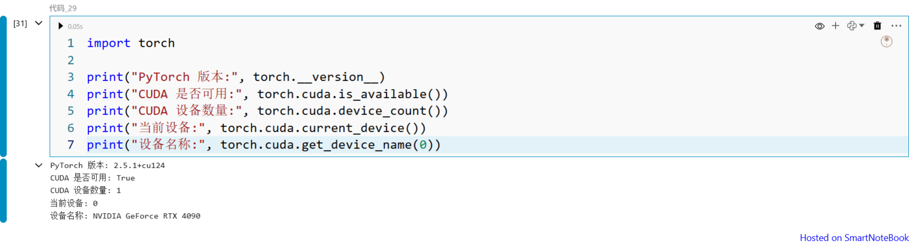

# Notebook 的GPU 支持，以torch示例

## 1. CUDA 安装

cudu 默认已经内置了 NVIDIA 驱动。如果在宿主机上额外安装驱动，可能导致版本冲突，出现 安装失败 等问题。
NVIDIA CUDA 下载地址，可以根据系统类型进行筛选：

https://developer.nvidia.com/cuda-downloads?target_os=Linux&target_arch=x86_64&Distribution=Ubuntu&target_version=24.04&target_type=runfile_local

安装命令如下：
```
wget https://developer.download.nvidia.com/compute/cuda/13.0.0/local_installers/cuda_13.0.0_580.65.06_linux.run
sudo sh cuda_13.0.0_580.65.06_linux.run
```
## 2. docker及container-toolkit


从 Docker 20 版本开始，Docker 已经原生支持 docker compose 命令，不再需要单独安装 docker-compose。

因此需要确保安装 Docker 28+，并安装 docker compose 插件。

### 安装 Docker：

```
curl -LO  https://download.docker.com/linux/static/stable/x86_64/docker-28.3.3.tgz
sudo tar xzvf docker-28.3.3.tgz -C /usr/bin --strip-components=1
# 测试
docker --version
sudo dockerd &
```

### 安装 docker compose 插件：

```
curl -LO https://download.docker.com/linux/ubuntu/dists/jammy/pool/stable/amd64/docker-compose-plugin_2.39.1-1~ubuntu.22.04~jammy_amd64.deb
sudo dpkg -i  docker-compose-plugin_2.39.1-1~ubuntu.22.04~jammy_amd64.deb
```

### 安装 NVIDIA Container Toolkit（用于容器访问 GPU）， 安装文档：

https://docs.nvidia.com/datacenter/cloud-native/container-toolkit/1.17.8/install-guide.html

修改运行脚本 docker-compose-simple.sh：

```
# more docker-compose-simple.sh 
# version must be >= 1.8.8
export VERSION=1.8.10
export EXPOSE_PORT=80
CMD="${1:-up -d}"
docker compose --file ./docker-compose-simple.yml  --project-name snb $CMD
```

## 3. docker-compose 添加GPU配置项
在完成 NVIDIA Container Toolkit 安装后，可以在 docker-compose.yml 中使用 gpus: all 来开启 GPU。

示例 docker-compose-simple.yml：

```
version: '3'

services:

   server:
     image:  registry.cn-hangzhou.aliyuncs.com/smartnotebook/snb-server:${VERSION:-1.8.8}
     privileged: true
     volumes:
       - ./data_server:/home
     command: ["python", "-m", "snb_server", "--allow-root"]
     ports:
       - "${EXPOSE_PORT:-80}:8080"
     restart: always

   node:
     image:  registry.cn-hangzhou.aliyuncs.com/smartnotebook/snb-node:${VERSION:-1.8.8}
     privileged: true
     volumes:
       - ./data_node:/home
     gpus: all
     restart: always
```

这里 node 服务绑定了宿主机 GPU，Notebook 内部的 Python 环境即可调用 CUDA。
## 4. 安装torch及测试

进入 Notebook 或容器后，安装 torch：

``` 
pip install torch==2.5.1 
```

测试 GPU 是否可用：

```
import torch

print("PyTorch 版本:", torch.__version__)
print("CUDA 是否可用:", torch.cuda.is_available())
print("CUDA 设备数量:", torch.cuda.device_count())
print("当前设备:", torch.cuda.current_device())
print("设备名称:", torch.cuda.get_device_name(0))
```



如果输出结果显示 CUDA is available: True，并且能正确列出 GPU 型号（如 NVIDIA A100），说明 Notebook 已经成功开启了 GPU 支持。